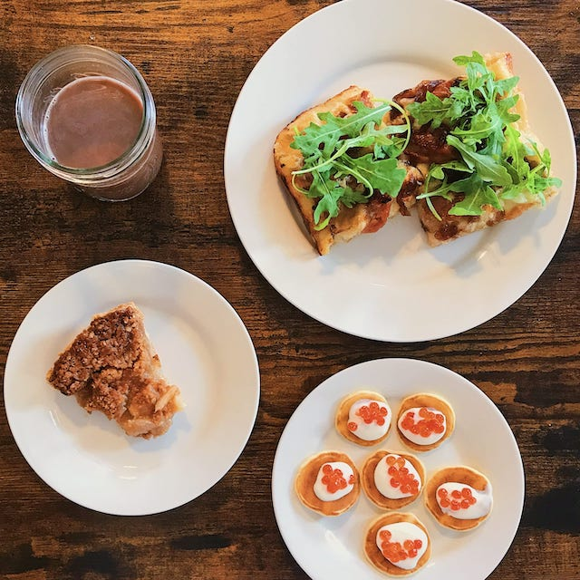

# Howdy, I'm Robert 👋🤠

{: .main-img}{: .main-img}{: .main-img}{: .main-img}

I'm a computer science major at Northeastern University. After taking various courses and spending nine months as a co-op with the Release Engineering team at [Wayfair](https://www.wayfair.com), I've become somewhat of a jack of all trades from code writing to shipment. Most of my development experience has been in Python, but I am always open to learning new tools as a developer.

When I'm not groaning at Python code or CI/CD builds, I enjoy spending my time cooking, scuffing up my joints on a skateboard, or binge-consuming mechanical keyboard content.

### Contact Info 📲

* *Email me at [yin.rob@northeastern.edu](mailto:yin.rob@northeastern.edu)*  📬
* *Glance at my [current resume](assets/files/robert_yin_resume.pdf)*  📜
* *Connect with me on [LinkedIn](https://www.linkedin.com/in/boberto)*  👥
* *Check out my code on [GitHub](https://github.com/bobertoyin)*  📁

### Current Status 📍

* *Gearing up to join [Morse CORP](https://www.morsecorp.com) as a Python SWE co-op for the Spring 2022 semester*  🐉
* *Learning to become an emoji enthusiast, one emote at a time*  🦾
* *Scheming up a silly personal project with Docker and/or Python*  🐍 🐳
* *Completing the renovation of my [portfolio site](https://github.com/bobertoyin/bobertoyin.github.io) for the ~~third~~ fourth time*  📐

---

# Experience 💼

## Python Software Engineering Co-op at [Morse CORP](https://www.morsecorp.com)
#### January 2022 - Present

> ***THIS SECTION IS CURRENTLY UNDER CONSTRUCTION***  🚧 

## Software Engineering Co-op at [Wayfair](https://www.wayfair.com)
#### January 2021 - August 2021

* *Followed **DevOps** practices to maintain and improve Wayfair's **CI/CD** platform for thousands of engineers who deploy their own decoupled services.*
* *Completed and created tasks and goals with teammates using the **Scrum/Agile** framework, ranging from feature implementations to RFCs and investigations.*
* *Developed **communication workflows** and a ChatOps bot to **automate** frequently occuring troubleshooting questions from engineers trying to deploy.*
* *Created an internal **decoupled web service** using our CI/CD platform to uncover hidden toil in our team's troubleshooting requests.*

## Teaching Assistant at [Northeastern University](https://www.northeastern.edu)
#### September 2020 - December 2021

* ***Guided office hours** to review key concepts for the **Discrete Structures** course for dozens of students.*
* ***Graded** a score of problem sets and exams on a weekly basis.*

## WordPress Development Intern at [TestFirst Lawn Care]()
#### January 2019 – August 2019

* *Developed the site’s **back-end** to allow dozens of users to view and understand soil test results.*
* *Wrote code in **PHP**, **HTML**, and **MySQL** while communicating with a front-end developer.*

---

# Projects 🛠

## Spotify Song Genre Prediction
#### Machine Learning and Data Mining I

Source code can be found in this [GitHub repository](https://github.com/bobertoyin/ds4400-project).

* *Collaborated with two partners to **train**, **cross-validate**, and **test** three **classification algorithms** to classify genres of Spotify songs based on auditory features.*
* *Built using the **Scikit-learn**, **Pandas**, and **Seaborn** Python libraries in a **Jupyter Notebook** environment.*

## Portfolio Site
#### Personal Project

Source code can be found in this [GitHub repository](https://github.com/bobertoyin/bobertoyin.github.io).

* *Chock-full of **emojis** and whatnot, along with plenty of **Markdown** files.*
* *Built using the **Jekyll** static site generator and designed with custom **SCSS** and **HTML**.*

## ExCELlence Animator
#### Object-Oriented Design
* *Collaborated with a partner to build a **simple cel animator** with the ability to **view, edit, and export**.*
* *Developed using the **Java Swing** GUI library and **MVC design** principles.*

---

# Skills 🧮

* {: .no-bullet} 🐍  **Python** - *Proficient*
* {: .no-bullet} 🖥  **\*nix** - *Proficient*
* {: .no-bullet} 💾  **Git** - *Proficient*
* {: .no-bullet} 🚢  **CI/CD** - *Competent*
* {: .no-bullet} ☕️  **Java** - *Competent*
* {: .no-bullet} 🎨  **CSS** - *Competent*
* {: .no-bullet} 🐳  **Docker** - *Competent*
* {: .no-bullet} 📡  **Cloud Services** - *Novice*
* {: .no-bullet} 🔌  **Terraform** - *Novice*
* {: .no-bullet} 🎛  **Puppet** - *Novice*
